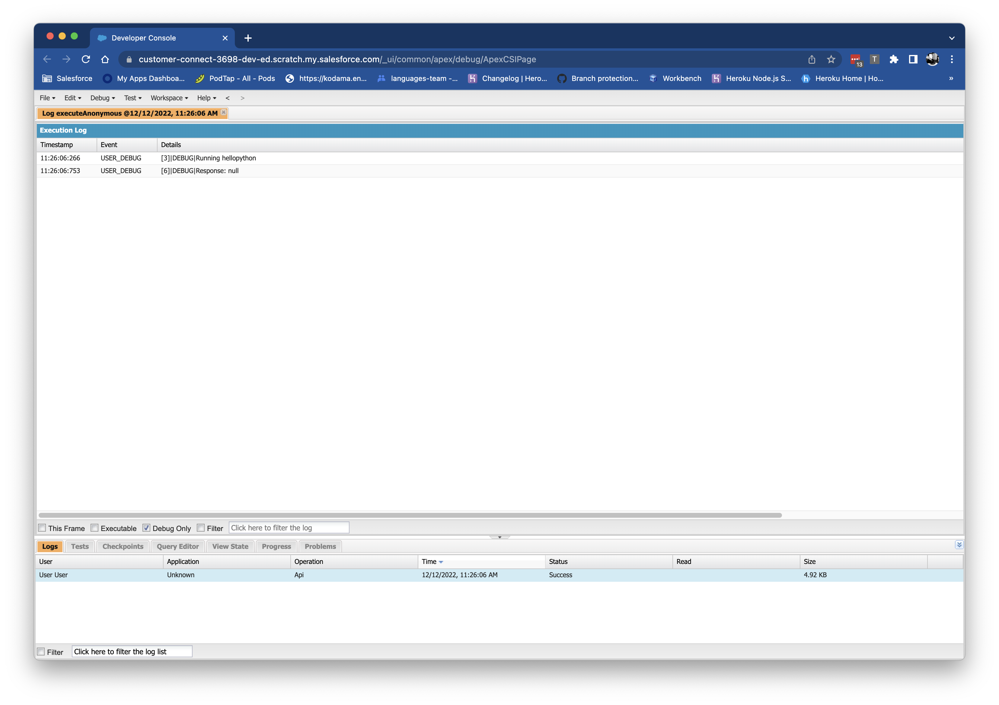

# sf-functions-python

[](https://pypi.org/project/salesforce-functions/)
[](https://pypi.org/project/salesforce-functions/)
[](https://github.com/heroku/sf-functions-python/actions/workflows/ci.yml)

Python support for [Salesforce Functions](https://developer.salesforce.com/docs/platform/functions/overview).

> Note: This feature is a Beta Service. Customer may opt to try such Beta Service in its sole discretion. Any use of the Beta Service is subject to the applicable Beta Services Terms provided at [Agreements and Terms](https://www.salesforce.com/company/legal/agreements/). 

---

# Getting Started with Python for Functions

## Prerequisites

> Install commands assume an Apple macOS system with Homebrew available.  If you’re on another OS you’ll have to click through the links to get alternative install instructions.

### [Install Python 3](https://www.python.org/downloads/)

```sh
brew install python3
```

The installed Python version must be at least `3.10` or higher.

Check your version of python with `python3 --version`.

> On some machines Python and Pip commands must be run using python3 or pip3, which point to the Homebrew-managed Python interpreter. Using python or pip instead often points at the system installed Python interpreter.  

### [Install Git](https://git-scm.com/downloads)

```sh
brew install git
```

The installed Git version should be at least `2.36.0` or higher.

Check your version of git with `git --version`.

### [Install / Update the Salesforce CLI](https://developer.salesforce.com/docs/atlas.en-us.sfdx_setup.meta/sfdx_setup/sfdx_setup_install_cli_rc.htm)

[Install the Salesforce CLI](https://developer.salesforce.com/docs/atlas.en-us.sfdx_setup.meta/sfdx_setup/sfdx_setup_install_cli.htm) if you haven't already.

Update to the latest version of Salesforce CLI that contains
Python functions support:

```sh
sfdx update
```

The command `sfdx update` updates both the `sfdx` and `sf` commands.

Check your version of the Salesforce CLI with `sf --version`. The installed version of `sf` should be `1.59.0` or higher.

### [Create a Salesfoce DX Project](https://developer.salesforce.com/docs/platform/functions/guide/create-dx-project.html)

Create a DX project in the directory you want your Salesforce Functions project to be located. 

```sh
sf generate project --name PythonFunctionsBeta
```

Some of the following commands run from within the SFDX project directory. 

Navigate to your SFDX directory:

```sh
cd PythonFunctionsBeta
```


Add the `Functions` feature needed for connecting and deploying Functions in scratch orgs. Edit the `config/project-scratch-def.json` file to include the **`Functions`** feature.

For example:
```json
{
  "orgName": "SomeOrgName",
  "edition": "Developer",
  "features": ["EnableSetPasswordInApi", "Functions"],
  "settings": {
    "lightningExperienceSettings": {
      "enableS1DesktopEnabled": true
    },
    "mobileSettings": {
      "enableS1EncryptedStoragePref2": false
    }
  }
}
```
> Note: We recommend using a Dev Hub and scratch org for Salesforce Functions development. See [Connect and Prepare your Development Environment](https://developer.salesforce.com/docs/platform/functions/guide/connect-dev-org.html).

Your SFDX project needs to be a git repo to deploy any Salesforce Function because the deployment process 
uses git tracked changes to figure out what to deploy.  Run the following commands to setup git:

```sh
git init
```

Commit your changes locally for deployment. 
> It is not a requirement to push your code to GitHub or any other code hosting site but can be useful for [sharing and maintaining functions code](https://developer.salesforce.com/docs/platform/functions/guide/dev-alm-workflow.html?q=github#maintain-and-share-function-source-code). 

### Connect Your Org

Configure your Salesforce org to develop and invoke Salesforce Functions. Develop your functions in scratch 
orgs with Dev Hub or in sandbox orgs. Follow the steps on 
[Configure Your Org](https://developer.salesforce.com/docs/platform/functions/guide/configure_your_org.html) to ensure everything 
is setup.

Once your Org is configured, log in and set it as the default Dev Hub with the following command:

```sh
sf login org --alias PythonOrg --set-default-dev-hub --set-default
```

**PythonOrg** is the the default Dev Hub for subsequent commands.

Create a scratch org:

```sh
sfdx force:org:create \
  --definitionfile config/project-scratch-def.json \
  --setalias PythonScratch \
  --setdefaultusername
```

Now when you run a Function, it will connect to and use the **PythonScratch** org.

### Connect Your Compute Environment

Log in to Salesforce Functions with the same credentials you used to connect your Dev Hub org.

```sh
sf login functions
```

Create the compute environment and associate it with the **PythonScratch** org we created while
connecting your org.

```sh
sf env create compute \
  --connected-org PythonScratch \
  --alias PythonCompute
```

Future functions deployed to the **PythonCompute** environment are linked to 
your scratch org.

### Assign Permissions

The default Python project requires `read` access to the `Account` object in your scratch org. Create 
a file named `force-app/main/default/permissionsets/Functions.permissionset-meta.xml` in your SFDX project and add the following content:

```xml
<?xml version="1.0" encoding="UTF-8"?>
<PermissionSet xmlns="http://soap.sforce.com/2006/04/metadata">
    <description>Permissions for Salesforce Functions to access Salesforce org data</description>
    <hasActivationRequired>true</hasActivationRequired>
    <label>Functions</label>
    <objectPermissions>
        <allowCreate>false</allowCreate>
        <allowDelete>false</allowDelete>
        <allowEdit>false</allowEdit>
        <allowRead>true</allowRead>
        <modifyAllRecords>false</modifyAllRecords>
        <object>Account</object>
        <viewAllRecords>false</viewAllRecords>
    </objectPermissions>
</PermissionSet>
```

Upload the permission set to your org.

```sh
sf deploy metadata --ignore-conflicts
```

Then assign the permissions to the `Functions` profile.

```sh
sfdx force:user:permset:assign -n Functions
```

## Create and Run a Python Function Locally

### Generate the Python Function

From the root directory of your SFDX project, run:

```sh
sf generate function \
  --language python \
  --function-name hellopython
```

Navigate to the `hellopython` folder.

```sh
cd functions/hellopython
```

### Create the Python [Virtual Environment](https://docs.python.org/3/library/venv.html#creating-virtual-environments) & Install Dependencies

Create a "Virtual Environment" (venv) before installing the dependencies required to run the Python function locally.
Install using packages without affecting your system Python installation by setting up your virtual environment.

Create the virtual environment.

```sh
python3 -m venv .venv
```

Activate the virtual environment.  

On a **macOS / Linux system**:

```sh
source .venv/bin/activate
```

On a **Microsoft Windows system**:
```sh
.\.venv\Scripts\activate
```

> See the [Python documentation](https://packaging.python.org/en/latest/guides/installing-using-pip-and-virtual-environments/#creating-a-virtual-environment) for help with setting up a virtual environment.

Finally, install the dependencies into the virtual environment.

```sh
pip3 install -r requirements.txt
```

Using a virtual environment ensures your function has all required dependencies before you run it.  

> Note: Starting the Function locally without setting up your virtual environment results in an error.

### Run the Python Function Locally

Start the function running locally. 

```sh
sf run function start
```

Messages logged by the running function will appear on http://localhost:8080.

### Invoke the Running Python Function

After starting the function, open a new command line terminal and navigate to the `hellopython` directory.

Invoke the function by sending it a payload.

```sh
sf run function --function-url http://localhost:8080 --payload '{}'
```

## Deploy the Python Function

Change to the root directory of your SFDX project before committing changes and running your function. 

```sh
cd ../../
```

### Commit your changes to Git

All code changes made to a function need to be staged and committed before you can deploy.

Commit all changes to your project.

```sh
git add .
git commit -m "Trying out python functions"
```

Deploy your functions project.

```sh
sf deploy functions --connected-org PythonScratch
```

This deployment process may take several minutes.

> Note: If you receive a `Request failed with status code 404` error message, check the earlier `sf env create compute` step was performed.

### Invoke the Function from Apex

Use Apex to invoke the function deployed to our scratch org. Generate an Apex class with:

```sh
sfdx force:apex:class:create \
  --classname ApexTrigger \
  --outputdir force-app/main/default/classes
```

Have your apex code lookup the reference to our function using the `functions.Function.get` method, invoke the function with an empty json payload, and
print the response.

Open `force-app/main/default/classes/ApexTrigger.cls` and replace it's contents with:

```java
public with sharing class ApexTrigger {
    public static void runFunction() {
        System.debug('Running hellopython');
        functions.Function fn = functions.Function.get('PythonFunctionsBeta.hellopython');
        functions.FunctionInvocation invocation = fn.invoke('{}');
        System.debug('Response: ' + invocation.getResponse());
    }
}
```

Upload this Apex class to your scratch org.

```sh
sfdx force:source:push --targetusername PythonScratch
```

Open a developer console.

```sh
sfdx force:org:open -p /_ui/common/apex/debug/ApexCSIPage
```

Execute the function from the developer console.

On a **macOS / Linux system**:

```sh
echo "ApexTrigger.runFunction();" | sfdx force:apex:execute -f /dev/stdin
```

On a **Microsoft Windows system**:

```sh
echo "FunctionApex.test();" | sfdx force:apex:execute
```

The developer console shows a log entry in the bottom panel after the function executes, which you can double-click to open.
Toggle the Debug Only filter to reduce the log messages to just the ones from the `ApexTrigger` function.

You should see a view like the one below:



---

> NOTE: You may encounter the following error

```
System.CalloutException: Error during Salesforce Functions Sync Invocation. Ensure that 
function 'PythonFunctionsBeta.hellopython' is deployed and its status is 
available ('OK', 'up'). If issue persists, contact Salesforce Support.
```

If you see this then there may not be a problem, the function just might not be available yet in the compute 
environment. Wait several minutes and then try the command above again.
